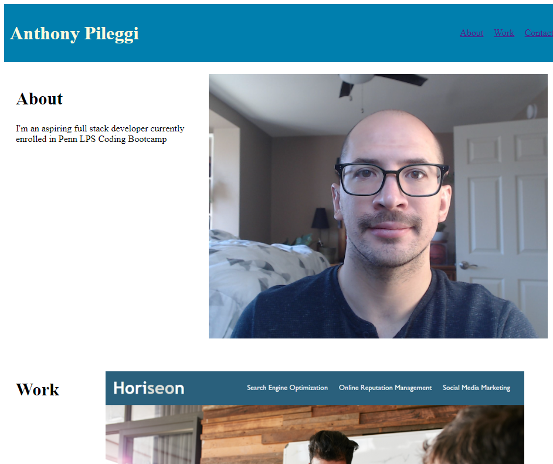

# Anthony Pileggi Portfolio

## Description
This webpage was created to show web applications I have developed since starting the Penn LPS bootcamp. When A user loads the page they will see my name, picture, work, and conctact informaiton. This project also helped increase my understaning of responsive design in developing a webpage.

## Installation
N/A

## Usage
When a user loads the webpage, they will see information about myself and my projects. When a user clicks on an image of an existing project, the image will link to the live webpage displayed. When the user changes the size of their browser window the layout will adjust to the size of their new browser window.

## Credits
N/A

## License
Please refer to the license in the repo
